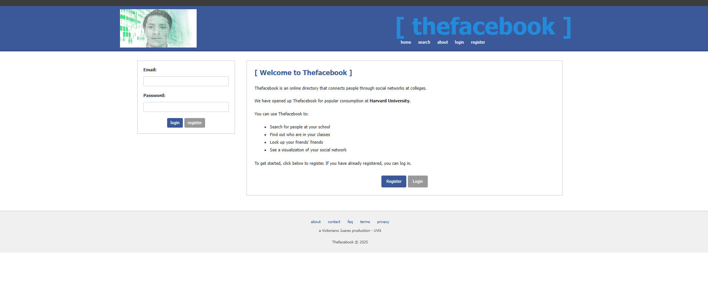

# TheFacebook Clone - Proyecto PHP

Réplica funcional de la versión original de thefacebook.com (2004) usando PHP, HTML, CSS, JavaScript y MySQL.

## Vista principal



## 📋 Características Implementadas

✅ **Registro de usuarios**

- Validación de correos universitarios (solo dominios .edu)
- Bloqueo de correos personales (Gmail, Hotmail, Yahoo, etc.)
- Validación en cliente y servidor
- Contraseñas en texto plano

✅ **Sistema de Login**

- Autenticación con email universitario y contraseña
- Sesiones seguras con `session_start()`

✅ **Página Principal (Home)**

- Muestra información del usuario logueado
- Avatar en el navbar
- Diseño fiel al original de 2004

✅ **Página About (Creadores)**

- Sección con información del equipo
- Fotos y roles de los integrantes

✅ **Diseño Retro**

- Basado en capturas históricas de thefacebook
- Colores azul característico (`#3B5998`)
- Bootstrap 4.6 para responsividad

## 🗄️ Configuración de Base de Datos

### 1. Crear la Base de Datos

Manualmente:

1. Accede a phpMyAdmin o tu gestor MySQL
2. Crea una base de datos llamada `thefacebook`
3. Importa el archivo `thefacebook.sql`

### 2. Configurar Conexión

Edita `config.php`:

```php
define('DB_HOST', 'localhost');
define('DB_USER', 'tu_usuario');
define('DB_PASS', 'tu_contraseña');
define('DB_NAME', 'thefacebook');
```

## 📁 Estructura del Proyecto

```
thefacebook/
├── config.php              # Configuración DB y funciones
├── index.php               # Página de bienvenida
├── login.php               # Página de login
├── register.php            # Página de registro
├── home.php                # Página principal del usuario (Perfil)
├── profile.php             # Ver perfil de otros usuarios
├── edit.php                # Editar perfil
├── about.php               # Página sobre el proyecto
├── friends.php             # Lista de amigos
├── search.php              # Búsqueda de usuarios
├── terms.php               # Términos de uso
├── logout.php              # Cerrar sesión
├── thefacebook.sql         # Schema de base de datos
├── .htaccess               # Configuración Apache
├── css/
│   └── style.css          # Estilos personalizados (diseño original 2004)
├── js/
│   └── validation.js      # Validaciones del cliente
├── includes/
│   ├── header.php         # Header común con navbar azul
│   ├── sidebar.php        # Sidebar común con quick search
│   └── footer.php         # Footer común
├── uploads/               # Directorio para avatares
│   ├── default-avatar.jpg
│   ├── creator1.jpg       # Foto integrante 1
│   ├── creator2.jpg       # Foto integrante 2
│   └── creator3.jpg       # Foto integrante 3
└── images/                # Imágenes del sitio
    └── face-icon.png      # Icono del header
```

## 🚀 Instalación Local

### Requisitos

- PHP 7.4 o superior
- MySQL 5.7 o superior
- Apache

### Pasos

1. **Clonar/Descargar el proyecto**

```bash
cd /var/www/html  # o tu directorio web
# Copiar todos los archivos del proyecto aquí
```

2. **Crear carpeta de uploads**

```bash
mkdir uploads
chmod 755 uploads
```

3. **Importar base de datos**

```bash
mysql -u root -p < thefacebook.sql
```

4. **Configurar config.php**

- Editar credenciales de base de datos
- Cambiar SITE_URL si es necesario

5. **Acceder al sitio**

```
http://localhost/thefacebook
```

## 🌐 Despliegue en Hosting Gratuito

### Opcion Recomendado

#### 1. InfinityFree

- URL: https://infinityfree.net
- PHP, MySQL, 5GB espacio
- Sin anuncios forzados
- Subdominio gratuito

**Pasos:**

1. Crear cuenta en InfinityFree
2. Crear nuevo sitio web
3. Subir archivos vía FileZilla (FTP)
4. Crear base de datos en cPanel
5. Importar `thefacebook.sql`
6. Editar `config.php` con credenciales del hosting

### Configuración para Producción

1. **Editar config.php:**

```php
define('SITE_URL', 'http://tu-sitio.infinityfreeapp.com');
```

2. **Permisos de carpetas:**

```bash
chmod 755 uploads/
```

## 👥 Dominios Universitarios Permitidos

Por defecto, estos dominios están permitidos:

- uvg.edu.gt (Universidad del Valle de Guatemala)
- usac.edu.gt (Universidad de San Carlos)
- url.edu.gt (Universidad Rafael Landívar)
- ufm.edu (Universidad Francisco Marroquín)
- harvard.edu
- mit.edu
- stanford.edu

## 📸 Capturas de Referencia

El diseño está basado en:

- [Internet Archive](https://web.archive.org/web/20040212031928/http://www.thefacebook.com/)
- [Imágenes históricas de 2004](https://www.webdesignmuseum.org/gallery/facebook-2004)

## 👨‍💻 Tecnologías Utilizadas

- **Backend:** PHP 7.4+
- **Base de Datos:** MySQL 5.7+
- **Frontend:** HTML5, CSS3, JavaScript
- **Framework CSS:** Bootstrap
- **Servidor Web:** Apache

## 📄 Licencia

Proyecto educativo - Universidad del Valle de Guatemala

## 🤝 Contribuciones

Proyecto académico. Para agregar mejoras:

1. Fork el proyecto
2. Crea una rama (`git checkout -b feature/mejora`)
3. Commit cambios (`git commit -am 'Agregar mejora'`)
4. Push a la rama (`git push origin feature/mejora`)
5. Crear Pull Request

## 📞 Contacto

Para dudas sobre el proyecto, contactar a:

- Victoriano Juarez jua2451952@uvg.edu.gt

---

**Desarrollado con ❤️ para el curso de Programación Web**
